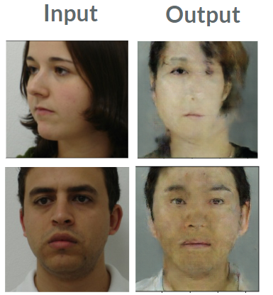

# Face Frontalization

This project generates frontal faces of any human being's faces.


# Data

Data is consisted of 300 korean face data

**You can download data here**

[AI 오픈 이노베이션 허브](http://aihub.or.kr/)


# Data Preprocessing

## Face Crop

Crop only face pixels of original image to **maximize the feature extraction efficiency**

Used functions and pretrained models in **Dlib** to crop faces


First, we try cropping image by using **Frontal face detector by Dlib**
```python
face_detector = dlib.get_frontal_face_detector()
rects = face_detector(image, 1)
```
If **Frontal face detector** does not find faces, try finding by using **MMOD human face detector**

```python
if len(rects) == 0:
    cnn_face_detector = dlib.cnn_face_detection_model_v1('./models/mmod_human_face_detector.dat')
    rects = cnn_face_detector(image, 1)
```

Use 68 face landmark detections to get the entire face

```python
dlib_landmark_model = 'models/shape_predictor_68_face_landmarks.dat'
face_regressor = dlib.shape_predictor(dlib_landmark_model)
pts = face_regressor(image, faceBoxRectangleS).parts()
pts = np.array([[pt.x, pt.y] for pt in pts]).T
roi_box = parse_roi_box_from_landmark(pts)
```
And crop image using roi box

```python
cropped_image = crop_img(image, roi_box)
```
## Face Crop Result

In Train datasets, **we did not use MMOD** CNN crop because it takes too much time (70seconds per 12 images).

So in total 1,700,000 face data, almost half is lost because in train datasets using Frontal Face detection. But still making the total amount of dataset 720,000 images.

The image below shows the Distribution of face tilt degree.


### Train Input


### Train Label


# DataGenerator

Since the total data is 720,000 images, memory gets full rising an error when the data is loaded by numpy. So by using **datagenerator.py**, model **loads images every batch** to use memory efficiently.

# Model

We tried different kinds of models:

- **Autoencoder**
- **CVAE**
- **VGG16 Face**
- **Unet**
- **DCGan**
- **Pixel to Pixel Gan**

**And the best model is Autoencoder with VGG16 Face as encoder and adding Unet.**

## **CVAE**

**Conditional Variational Autoencoder**

This is the first model we tried and it did not work well. 

At first, we used different data to train and also did not crop faces.

So the output was too blury which seems like model could not make extract face features.


So after this model, we decided to **input cropped faces**, not the entire image

## DCGan

**Deep Convolutional Generative Adversarial Networks(DCGAN)**

DCGan did not work quite well




## Autoencoder + Unet ( Best Model )

After research, we decided to use **VGG16 Face** (pretrained model which extract face features from image) as our encoder.

And by researching more, we found **Patch Gan** which uses **Unet** to connect layers of encoder and decoders to **retrieve lost data.** 


**Encoder:  VGG16 Face**

**Decoder: Convolutional Layers using Unet**

## Pixel to Pixel Gan


**Generator: Same as previous model (VGG16 + Unet)**

**Discriminator: Patch Gan**

# Dependency
- Python 3
- Python Image Library
- Anaconda

- Keras
- Tensorflow
- VGG16 Face
- Dlib 

- Django

- Numpy
- Opencv
- Matplotlib
- Glob
